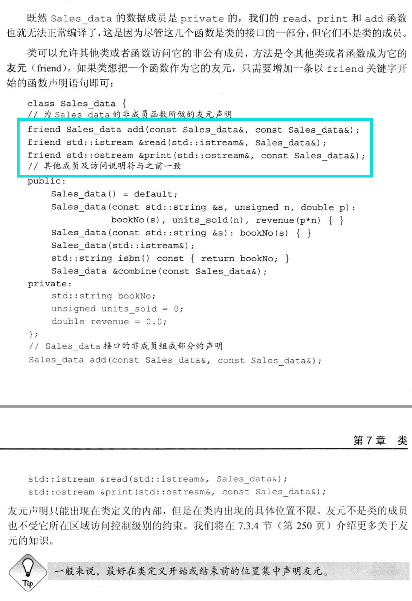

# 2020.03.04
* 根据模板创建类和函数的过程叫实例化

* 引用不是对象
这表明

* 老式编译器创建vector<vector<int>>时要写为"vector<vector<int> >"(加空格)

* size_t是无符号类型,可用于表示内存中任意对象的大小,由cstddef头文件定义

***

## 列表初始化
* vector\<string> articles = {"a", "an", "the"}; / vector\<string> articles{"a", "an", "the"}; 用花括号将括起来的值赋值给vector中的元素,这种方式称为列表初始化(C++11),这种方法也可用于结构体,数组等的初始化

* 在使用列表初始化时,花括号中的变量应该与初始化的类型对应,否则将调用其他方法.如:vector\<string> v1{10}; 调用的是vector的构造函数v1(10),即创建10个空的字符串.
***

    // 可以使用C++11的新的遍历方式访问列表等变量
    for(auto &i : v)
        i *= i;

* vector可以用下标来访问已经存在的元素,但是不能创建元素

***

## 迭代器

    // 用迭代器遍历标准库的方法:
    for(auto it = s.begin(); it != s.end(); ++it)
        //do something

* 泛型编程

* const_iterator只能用于读元素,不能用于写元素

* 调用begin,end函数返回时,根据对象是否是常量来确定返回的是iterator还是const_iterator

* cbegin,cend返回const_iterator类型

* 假设it指向vector\<string>对象中的某一元素,则可以用(\*it).empty()来判断是否为空字符串,不可用\*it.empty(),编译器会解释成解引用it中的empty()成员(PS:要切记将it看成类而不是单纯的指针)

* 为了方便调用it指向对象的方法,C++定义了->运算符,因此it->mem等效于(\*it).mem

* 在循环中使用迭代器,要注意不要向容器中添加元素

* 两个迭代器相加减可以得到它们的距离,类型是difference_type的带符号整型数

***

## 数组

* 数组初始化时的长度应该是已知的,维度必须是常量表达式

```
unsigned c = 42; 不是常量表达式 
constexpr unsigned z = 42; 是常量表达式
```

```
int *ptrs[10]; // 含有10个整型指针的数组
int &refs[10] = /*?*/; //错误,不存在引用的数组(因为它不是对象)
int (*ptr)[10] = &arr; //指向一个含有10个整数的数组
int (&ref)[10] = arr; //引用一个含有10个整数的数组
```

* **从右向左,从内向外来确定变量的类型**
    ```
    int *ptrs[10];
    数组->指针->int类型

    int (*ptr)[10];
    (*ptr)是指针,指向int类型的[10]大小的数组
    ```

* 数组和指针关系密切:
    ```
    string num[] = {"one", "two", "three"};
    string *p = &num[0];
    ```

* C++11中可以用begin(数组),end(数组)的形式获得指向头部和尾部的指针,即类似于标准库中迭代器的使用方法

***
## C标准库String函数

* cstring头文件定义

* 以'\0'结尾

```
strlen(p)
strcmp(p1, p2)
strcat(p1, p2)
strcpy(p1, p2)
```

* 如果直接用<,>对比,错误,需要用strcmp

* C++ string标准库中c_str()返回C标准库string
    ```
    string s("Hello World!");
    const char *str = s.c_str();
    ```

***
* 用数组初始化vector对象
    ```
    // 用数组的头指针和尾指针来初始化vector
    int int_arr[] = {0, 1, 2, 3, 4, 5};
    vector<int> ivec(begin(int_arr), end(int_arr));
    ```
***
***

# 2020.03.05

## 多维数组
* 可使用C++的for遍历方式,但要注意父级需要用引用
    ```
    for(const auto &row : ia)
        for(auto col : row)
            cout << col <<endl;
    ```

***

## 左值 右值
* C语言定义: 左值可以位于赋值语句左侧,右值不能

* C++定义: 当一个对象被用作右值时,用的是对象的值(内容); 当对象被用作左值的时候,用的是对象的身份(在内存中的位置)

    * 需要右值的地方可以用左值代替,反之不行

    * 取地址符作用于左值对象时,返回的是指向该**运算对象的指针**,这个指针是一个右值

***

## 求值顺序

```
int i = 0;
cout << i << " " << ++i << endl;
++i需要经过运算才能得到值,上式运算结果是不可预测的,与编译器的处理方式有关,0 1或1 1,等等
 ```

***

* 小整型数据类型,一般会在参与运算的过程中提升为int(或以上)

    ```
    bool b = true;
    bool b2 = -b; // b2是true!
    // 在b2 = -b的过程中,b被提升为int类型,即b = 1,故b2 = -1 != 0,b2为true
    ```

* 取余运算定义

    ```
    // m%(-n) == m%n;(-m)%n==-(m%n)
    21 % 6 --- 3
    21 % 7 --- 0
    -21%-8 --- -5
    21 %-5 --- 1
    ```

* && 和 ||的短路

## 赋值运算符

* 右结合律:从右到左进行赋值

* 防止发生未定义行为

    ```
    while(beg != s.end() && !isspace(*beg))
        *beg = toupper(*beg++);
    赋值表达式的右侧将beg指针移动了,编译器可能对会将表达式理解成以下两种之一(或者其他):
    *beg = toupper(*beg);
    *(beg + 1) = toupper(*beg);
    ```

* 移位运算符

    * 左移<<,向右侧填0

    * 右移>>,根据作用对象是否有符号,是否为负值来确定

## sizeof

```C++
int a = 1;
int b;
sizeof(a);
sizeof(b);
sizeof a;
sizeof b;
// sizeof 不需要实际计算运算对象的值,即使对象无效也可以得到结果
```

* sizeof 作用于string和vector时只返回固定部分的大小,而不是类的大小

* sizeof(ia) / sizeof(*ia)来获得ia的元素数量(对于多为数组,获得的是维度)

***

# 2020.03.06

* 隐式类型转换
    

* 无符号类型运算对象处理
    

* 算术转换实例
    

## **强制转换**
* **尽可能的避免使用强制转换**  
    格式: cast-name<type>(expression);  

    其中cast-name是static_cast,dynamic_cast,const_cast,reinterpret_cast其中一种

* static_cast  
    常规转换,已定义行为,不发出警告

* const_cast
    将const类型变量转换成非常量  
    

* reinterpret_cast
    强制转换,不安全

***

* switch中的case和其对应的值一起被称为case标签,它必须是整型常量表达式

* 使用switch时,如果没有在case中加括号,且case中含有定义变量并初始化的行为,则出错(注意,如果只是定义变量而不初始化,不认为是错误的).  
    因为case中的变量的作用域超过case本身,运行过程中又是可能跳过的.  
    为了能够让人更好的理解,最好在这种case中加上花括号.

# 2020.03.08

## 可变形参函数

* 当传递的实参类型相同,可以传递一个名为initializer_list的标准库类型

* Initializer_list实例


***

# PS:回顾 const 指针 引用 数组

## return返回

* 不要返回局部变量的指针或引用类型,其在函数调用结束后将丢失

* 返回数组的指针的声明


***

## 函数重载

* 重载函数的要求


* 重载被覆盖的问题


* 调试信息


* 函数匹配


* 函数指针


# 2020.03.09

* 类的初始化过程中,编译器首先编译成员的声明,然后才是成员函数的声明,因此成员函数可以直接调用成员而不用在意其定义的顺序.

* 类的构造,析构,拷贝,赋值都有磨人的合成函数(即就算不定义,也会有默认的行为,无参数),但当定义了含有参数的以上函数后,会使得合成函数不生成,如果还需要使用,则可以在函数后面添加'= default'.

* 类内可以定义成员的初始值

* 用mutable修饰的成员变量在const函数中可以修改值

## **回顾友元**

***

* 友元声明简例


* 定义类型成员


* 可以定义友元类,也可以将其他类中的某些方法设置成友元类方法

* 友元声明和作用域


* 成员定义中普通块作用域名字的查找顺序


# 2020.03.10

* 构造函数初始值列表


* 成员的初始化顺序与其在类中定义的顺序一致

* 委托构造函数: 委托构造函数调用所属类的其他构造函数执行自己的初始化过程.

* 默认构造函数的作用


* 隐式的类类型转换


    * 可以将构造函数声明为explicit以阻止上面的隐式类类型转换,也就是说,被explicit修饰的构造函数只能直接初始化.

* 聚合类:  
    当类满足以下条件时,称为聚合类  
    * 所有成员是public.
    * 没有定义任何构造函数.
    * 没有类内初始值.
    * 没有基类,也没有虚函数.

    ```C++
    struct Data{
        int val;
        string s;
    }
    // 聚合类的初始化可以用花括号(C++11)
    Data val1 = {0, "Anna"};
    ```

    * 聚合类的初始化任务交给了类的使用者,而且在修改类的成员后需要相应的修改类的初始化语句,这是聚合类主要的缺点

* 字面值常量类

    * constexpr函数的 **参数** 和 **返回值** 必须是字面值类型,类也可以是字面值类型

    * 数据成员都是字面值的类型的聚合类是字面值常量类

    * 字面常量类
    

*** 

## **静态成员**

* 静态成员函数不包含this指针,因此不能定义成const,也不能用this指针来访问非静态成员

* 只需在类的内部声明时使用static关键字即可,在外部定义时不能重复使用static.

* 静态成员变量初始化


* 静态成员与普通成员的不同


## IO类

* 三种独立的IO相关头文件
    * iostream
    * fstream
    * sstream
    

* IO对象没有拷贝和赋值的操作

* IO库条件状态


* 管道输出缓冲
    * 系统为了降低io的次数,提高io效率
    * 使用endl,ends,flush函数可以刷新缓冲区,而且在切换cin,cerr,cout之间也会刷新缓冲区
    * cout << unitbuf; 表示所有输出操作后立即刷新缓冲区,即无缓冲,可用cout << nounitbuf; 回到正常模式.
    * 程序运行结束时会刷新缓冲区,但如果程序崩溃,输出缓冲区不会被刷新.

* 关联输入输出流


***

## 文件输入输出

* fstream常用操作


* fstream是iostream子类,因此可以在调用参数为iostream& 的地方传入fstream.

* 如果需要用同一指针打开其他文件,需要先将close()当前的文件

* fstream在离开作用域被销毁的时候回自动关闭.(析构)

* 文件模式


* stringstream_string流


* 使用ostringstream


# 2020.03.11

## 容器

* 顺序容器类型


* 确定使用哪种顺序容器


* 容器操作


## 迭代器

* 迭代器的范围:左闭右开,[begin,end)

* begin()返回第一个元素位置的迭代器,rbegin()返回最后一个元素位置的迭代器,两个都可以进行++操作,但是移动的方向是相反的(在前面加c表示const).

***

* 容器定义和初始化


* 标准库array具有固定大小,是模板类型的一部分

    ```
    array<int, 42> // 类型是保存42个int的数组
    array<int> // 错误,未指定大小
    ```

* 标准库array


* 赋值和swap


    * [为什么对string调用swap会导致迭代器失效](https://www.cnblogs.com/ll-10/p/9633968.html)

    * [迭代器swap前后是否有效的判断](https://stackoverflow.com/questions/4124989/does-stdvectorswap-invalidate-iterators)

* 容器的关系运算(== < >)是通过元素的关系运算得到的,如果元素没有实现对应的关系运算的功能,则不能进行比较.

* 向顺序容器中添加元素的操作


* emplace_front,emplace,emplace_back分别对应于push_front,push,push_back.区别在于,push时是将参数中的对象拷贝到容器中,而emplace则是直接用参数在容器中构造元素.

* 每个顺序容器(包括array)都有front成员函数,而除了forward_list之外所有顺序容器都有back成员函数,它们用于返回对应元素的引用.

* at成员函数用于返回指定位置上的元素的引用.

* 顺序容器的删除操作


* forward_list特殊操作:因为单链表对当前元素的操作需要改变前面元素的指针,而从当前元素获取前一位元素指针的操作是困难的,因此forward_list定义insert_after,emplace_after,erase_after操作.

# 2020.03.12

* forward_list插入删除操作


* resize可以改变容器的大小(array除外),如果变小,删除后面的元素,如果变大,新增元素.

* 容器的改变对迭代器,指针,引用的影响


* 当在循环中改变了容器的大小,则要注意实时更新迭代器,如end()等,以免迭代器失效导致错误.

* string replace
    ```
    s.replace(11, 3, "aaaaa");
    // 在下标11的位置后删除3个字符,再插入"aaaaa"5个字符.
    ```

* string搜索操作


* string compare方法


* string和数值之间的转换


## 容器适配器

* 容器适配器定义


* stack操作


* queue操作


# 泛型算法

* find(it1, it2, val);  
//在it1,it2两个迭代器之间查找值为val.

* 泛型算法概述


